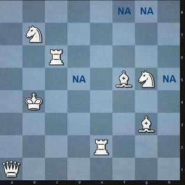

# Eight pieces on a chess board revisited

## Background

The problem of maximizing the number of squares on a chess board that can be attacked by the eight main pieces was first posed in 1849, but it wasn't until 1989 that it was finally solved by [Skiena and co-workers](https://academic.oup.com/comjnl/article/32/6/567/341699). The original problem can be summarized as follows:

### The Original Problem:

*"Is it possible to arrange all eight main chess pieces (the king, queen, two rooks, two knights, and two oppositely-colored bishops) in such a way that all 64 squares are under attack?"*

Skiena et al. showed that this is not possible. At best, eight pieces can attack 63 squares, meaning that at least one square remains unthreatened. For more information, readers are referred to the aforementioned article, which is freely available.

### Two New Variations:

In the original problem, the pieces themselves **must be under attack** in order to fulfill the condition. However, let's consider these two cases:

1. *"What is the maximum number of squares attacked by eight main chess pieces **if none of them are under attack** by any other piece?"*
2. *"What is the maximum sum of attacked squares by eight main pieces on a chess board **if none of them are under attack** by any other piece?"*

## Introduction

Lets take a look at the following position:



The problem's requirement is met since none of the pieces are under attack. So the total score for this position is:

1. 52 for the first part. Squares marked with NA (d5, h5, f8 and g8) are not covered. So the score is 64 minus 8 (pieces) minus (4 squares not under attack) = 52. Note that the maximum score possible is 64 minus 8 = **56**.
2. The score for the second part would be **87**. That is the sum of attacked squares by each of the pieces (see Table):

| K(b4) | Q(a1) | B(f5) | B(g3) | N(b7) | N(g5) | R(c6) | R(e2) |
| :---: | :---: | :---: | :---: | :---: | :---: | :---: | :---: |
|   8   |  21   |  11   |   9   |   4   |   6   |  14   |  14   |

The number of squares attacked by the rooks will always be **14 per rook**. The number of squares attacked by other pieces depends on their position. The maximum number of attacked squares is in the table below:

|  K   |  Q   |  B   |  N   |  R   |
| :--: | :--: | :--: | :--: | :--: |
|  8   |  27  |  13  |  8   |  14  |

Adding the values gives a sum of 105. However, it's clear that such a score is not possible since the two bishops and the queen would need to occupy three out of four central squares (d4, e4, d5, e5). This would be impossible since the queen would attack both bishops. So, what's the actual maximum theoretical score?

## Solution

Let's rephrase question No. 2: "Is it possible to arrange the eight main pieces so the score would be higher than 99?"

It's easy to obtain a 99-point position via Monte-Carlo simulation, but it would be too cumbersome to brute force all possible positions in search of a higher score. Let's check the following 99 setup:

```
. . R . . . . .
. . . . . . . .
. . . . N . . .
. N . . B . . .
. . . . B . K .
. . . . . . . .
. . . Q . . . .
. . . . . R . .
```

| K(g4) | Q(d2) | B(e4) | B(e5) | N(e6) | N(b5) | R(c8) | R(f1) |
| :---: | :---: | :---: | :---: | :---: | :---: | :---: | :---: |
|   8   |  23   |  13   |  13   |   8   |   6   |  14   |  14   |

It's important to note that the arrangement of the queen and two bishops is **the best possible one**. It's not possible to obtain a position in which QBB attacks more than 49 squares.

To get a 100+ position, the rest of the figures must attack at least 51 squares. The rooks always cover a fixed number of squares (28 in total), so it's easy to calculate that such positions can only occur if K and two N cover 23 squares or more. Such a position is possible in theory: if the king and two knights attack 8 squares each, the score in this case would be 101. **Does such a position actually exist?**

## The program

The program searches for all possible setups of Q, B, and B with a score of 49. Any positions leading to a lower score should not be further checked, as they can't possibly lead to a 100+ score. Due to the symmetry of the board, the Queen position should be chosen from the following set {b2, c2, d2, c3, d3, d4}. The queen can't be on the edge of the board as the maximum score for BNN would be 47.

Once the BNN setup is found, it's easy to brute force the position of all other pieces and look for the setup giving 100+ points.

## Results

It is not possible to obtain a position with 100+ points. `problem_2.py` found 167 unique positions with the score of 99 and 0 positions with the score 100+.

## Files

- `problem_2.py`. Solution to the second problem (Python 3.10).
- `display_board.py`. Simple function for board visualization.

## To-Do List:

- Add solution for variation number 1.

  Update: Monte-Carlo simulation showed that there are more than one solution for variation number 1. For example:

  ```
  R . . . . . . .    . . R . . . . .    . . R . . . . .
  . R . . . . . .    . R . . . . . .    . R . . . . . .
  . . . . . N . .    . . . . . . . .    . . . . . . . .
  . . . . . . . .    . . . K . . . B    . . . K . . . .
  . . . . . B . .    . . . . . B . N    . . . . . B . N
  . . . . . N . B    . . . . . . . .    . . . . . . . .
  . . Q . . . . .    . . . . . N . .    . . . . B N . .
  . . . . . . . K    Q . . . . . . .    Q . . . . . . .
  ```
  
- Documentation and refactoring for variation number 2.
  Update 2023/01/18: `problem_2.py` was further optimized and now completes in less than one second.
